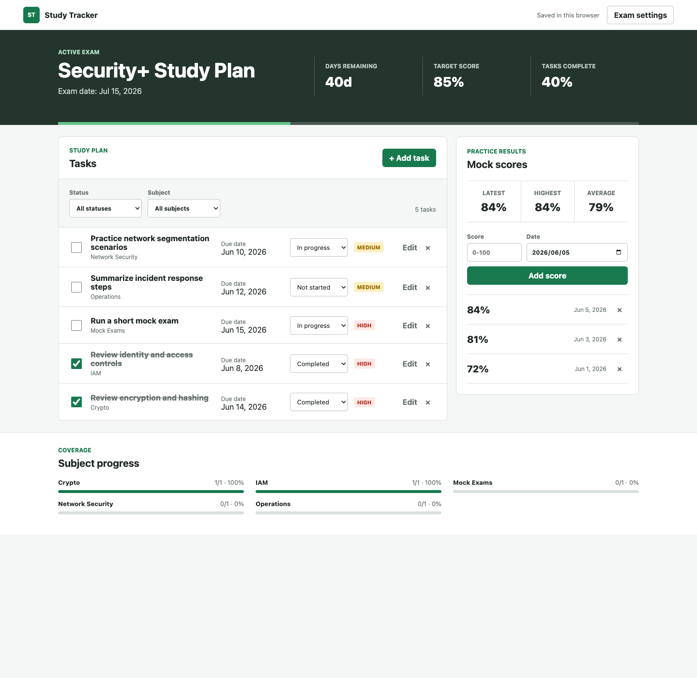

# Study Progress Tracker

[](https://github.com/ipeilin-ux/study-progress-tracker/actions/workflows/ci.yml)
[](LICENSE)
[](#)

A small, private-by-default browser app for tracking study tasks, subject
coverage, mock exam scores, and the countdown to an upcoming exam.

> **Practice project:** This repository was created only for programming
> practice and testing. It is not an official course, certification service,
> exam-preparation product, or source of exam materials. Do not enter real
> personal or confidential information.

The project uses plain HTML, CSS, and JavaScript. It has no runtime dependencies,
account system, analytics, or backend.

## Preview



The screenshot uses synthetic sample data only. The app keeps data in the
current browser and is GitHub Pages-ready from the repository root.

## Why This Repository Stands Out

- Self-contained: no packages to install and no external APIs to configure
- Privacy-first: all data stays in browser `localStorage`
- Testable: core calculations run under Node's built-in test runner
- Maintainable: state logic lives in a pure module separate from browser code
- Portable: the same files work locally or on GitHub Pages

## Repository Health

- Public, clean source tree with no bundled course material or exam banks
- Automated CI runs on GitHub Actions for every push and pull request
- Public `v1.0.0` release baseline with changelog support
- MIT licensed for straightforward reuse and contribution

Release notes are tracked in [CHANGELOG.md](CHANGELOG.md).

## Features

- Set an exam date and target score
- Track days remaining and overall task completion
- Add, edit, filter, complete, and delete study tasks
- Group progress automatically by subject
- Record mock exam scores
- View latest, highest, and average scores
- Keep data locally in the current browser
- Use the app on desktop and mobile

## Run Locally

ES modules require a local web server. From the repository root:

```bash
python3 -m http.server 8000
```

Open <http://localhost:8000>.

## Run Tests

The tests use Node.js's built-in test runner and require no installed packages:

```bash
node --test
```

## Deploy With GitHub Pages

1. Create a GitHub repository using the contents of this folder as its root.
2. Push the repository to GitHub.
3. Open the repository's **Settings**.
4. Select **Pages**.
5. Choose **Deploy from a branch**.
6. Select your branch and the `/(root)` folder, then save.

The expected Pages URL is `https://ipeilin-ux.github.io/study-progress-tracker/`.

## Data And Privacy

All exam, task, and score data is stored in the browser's `localStorage`.
Nothing is transmitted to a server. Clearing browser site data removes the
saved tracker data.

Do not enter real personal data, credentials, or confidential study material.
This repository is intentionally limited to practice data and local storage.

## Project Structure

```text
study-progress-tracker/
├── CHANGELOG.md
├── assets/
│   └── preview.png
├── app.js
├── index.html
├── docs/
│   └── codex-open-source-application-blurb.md
├── lib/
│   └── tracker.js
├── styles.css
├── tests/
│   └── tracker.test.js
├── LICENSE
├── package.json
└── README.md
```

`lib/tracker.js` contains pure state and calculation functions. `app.js`
connects those functions to the browser interface and local storage.

## Contributing

Pull requests are welcome if they keep the project dependency-free and aligned
with the existing privacy-first scope. Before opening a PR, run:

```bash
node --test
```

If you change browser behavior, verify the app in a browser on both desktop
and mobile widths. Avoid adding copyrighted course content, question banks,
or personal data handling.

See [CONTRIBUTING.md](CONTRIBUTING.md) for the full contribution checklist.

## Security

This project is designed to stay static and client-side. Report security or
privacy concerns through GitHub's private security advisory flow when possible.
Do not publish secrets, personal data, or sensitive study records in public
issues or pull requests.

See [SECURITY.md](SECURITY.md) for reporting guidance.

## License

MIT
